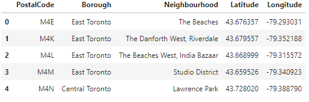
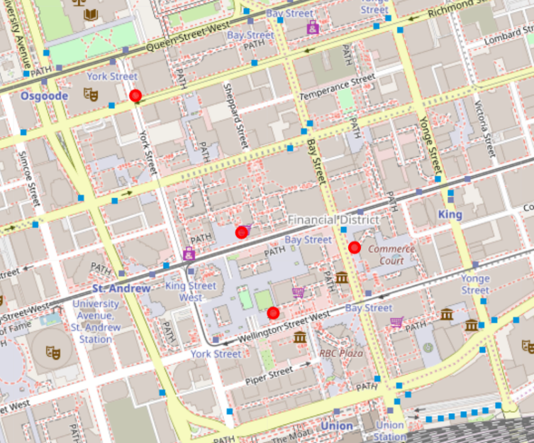
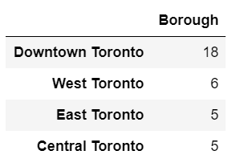
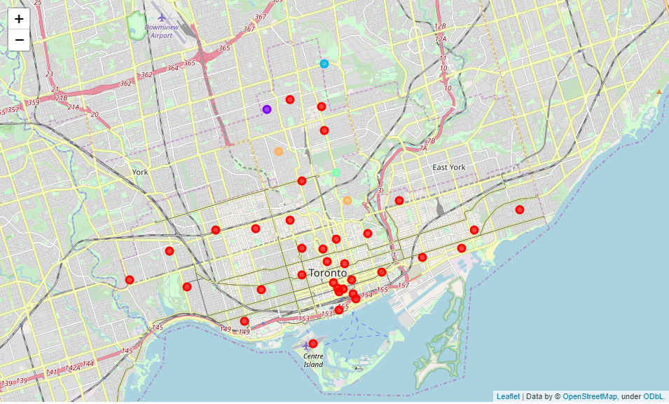

# Opening a New Fitness Centre in Toronto, Canada

Link to research papar: https://drive.google.com/file/d/1Sih4RhiaF3roJFEUEUkl53fflQDEmHpi/view?usp=sharing

## Overview

With the popularity of fitness centres and gyms on the rise in recent years, a lucrative business opportunity exists for those seeking to open one of their own in Toronto, Canada. This research project examined the ideal location to open a fitness centre in Toronto, based on characteristics within local neighbourhoods. Neighbourhood data was extracted from Wikipedia, neighbourhood data was pulled using the Foursquare Develop API, and transformed in such a way to create 5 clusters for the k-Means Clustering machine learning algorithm. Results showed that Downtown Toronto has the most local venues for which consider when opening the business. 

The findings suggested that the financial district has little to no competition, which might yield the most success for the business venture.

## File versions
- Week 1-4 are preliminary data analysis files, found in the 'project_files' folder
- The final files are included in the root directory and include the final pdf article and notebook:
  - **Final Code**: Toronto Neighbourhood Clustering.pynb
  - **Final Report**: Opening a New Fitness Centre in Toronto v1.pdf

### Prerequisites
 - Python 3.7
 - JupyterLab
 - Packages: pandas, numpy, scikit-learn, matplotlib, seaborn, folium, geopy, beautifulsoup
 - Foursquare API developer account (free)
 
## Walkthrough

### 1. Target Audience
The intended audience for this study is the aspiring or existing business owner who seeks to open a fitness centre in Toronto, Canada. Research indicates that as of 2018, the timing is optimal due to significant urban growth in the city. A report published by the city of Toronto suggests that urban plans aim to direct growth away from residential areas into avenues, centres and downtown.

### 2. Data Sources
The main driver behind the results produced from this study is the data. In order to solve the business problem, data will be gathered based on:

1. Toronto neighbourhood data. This defines the scope of the project which is limited to the city.
2. Latitude and longitudes pertaining to neighbourhoods within Toronto. This is also required to generate maps, and pull venue information.
3. Venue data from each individual neighbourhood. We will use the data to create clusters based on features within the neighbourhoods.

### 3. Data Collection

#### 3.1 Web Scraping

The first step was to gather the neighbourhood data for the city of Toronto. There are many ways to obtain this data, however I used the data available on the Wikipedia2 page, version February of 2020. This was performed by using a python library called BeautifulSoup, which specacializes in this task.

#### 3.2 Retrieving Coordinates using Geocoder

The newly obtained data is helpful, however it is essentially a table with postal codes, bouroughs, and neighbourhood names. In order to search for venues using the Foursquare API, I needed to provide it with coordinates. To do so, I used the python library called Geocoder which can convert our location names into geographical coordinates. The new coordinates were merged to the master table which includes the Toronto data.

In order to verify that the coordinates are in fact correct, I used Python’s Folium package which can create a map from the data provided. In my case, the map correctly displayed the city of Toronto.

#### 3.3 Pulling Venues using Foursquare API

The next step involved using the Foursquare Developer API to get the top 100 venues within a 500 meter radius. This was done through performing various API calls which pass in the exact coordinates (latitude and longitude). In turn, the API used the information in the API call to query its database and return a JSON file with the venue details. From this file, the relevant data was extracted and reshaped into a python Pandas data frame for further exploration and processing. I performed some statistics and aggregate functions to explore what kind of venues are nearby. This step helped in finding nearby venues which may complement a suitable location for the fitness centre.

### 4. Data Cleaning

The data must be processed into a usable format.

- The dataframe must consist of three columns: PostalCode, Borough, and Neighborhood
- Only cells with an assigned Borough will be processed; Boroughs which are 'Not assigned' are ignored.
```
toronto_df2 = toronto_df1.replace('Not assigned', np.nan)
toronto_df2 = toronto_df2.dropna(subset=['Borough'])
```
- More than one neighborhood exists in one postal code area. For example, in the table on the Wikipedia page, notice that M5A is listed twice and has two neighborhoods: Harbourfront and Regent Park. These two rows will be combined into one row with the neighborhoods separated with a comma, as shown in the 11th row.
- If a cell has a borough but a 'Not assigned' neighborhood, then the neighborhood will be the same as the borough.
- The .shape method to print the number of rows of your dataframe, for reference

### 5. Exploratory Data Analysis
I then proceeded to exploring the data set and its neighbourhoods.

- The Geopy package was used to find the geographical coordinates for Toronto
```
address = 'Toronto'
geolocator = Nominatim(user_agent="my-application")
location = geolocator.geocode(address)
latitude = location.latitude
longitude = location.longitude
print('The geograpical coordinate of Toronto are {}, {}.'.format(latitude, longitude))
```

- Add borough names to the the data frame, along with the coordinates



- Now that we have the unique borough names, the Foursquare API can be used to find popular venues within each neighbourhood

```
radius = 500
LIMIT = 100

nearby_venues = []

for lat, long, post, borough, neighbourhood in zip(tdot['Latitude'], tdot['Longitude'], tdot['PostalCode'], tdot['Borough'], tdot['Neighbourhood']):
    url = "https://api.foursquare.com/v2/venues/explore?client_id={}&client_secret={}&v={}&ll={},{}&radius={}&limit={}".format(
        CLIENT_ID,
        CLIENT_SECRET,
        VERSION,
        lat,
        long,
        radius, 
        LIMIT)
```


### 6. Model Building
#### Performing k-Means Clustering

The final step is the perform a clustering machine learning algorithm on the transformed data. In this case, the best algorithm to use is the k-means clustering method. This algorithm identifies a user-defined, k number of centroids, and and attempts to group similar data points towards a specific cluster based on its properties. A successful cluster is clearly visible and keeps the distance between the centroid and data point at a minimum.

In this case, we specified 5 k-clusters from which to determine which neighbourhoods have nearby attractions, already have gyms and overall appear to be suitable for a gym.



#### Examine Clusters

After examining the 5 k clusters, it was determined that Cluster 1 (Downtown Toronto) seems to be most optimal due to the plethora of local venues compared to the other 4 clusters.



Additional exploration into Cluster 1 revealed that this area is the Financial District, and has no local fitness centres.




## Final Thoughts

The results from this exploration can recommend current or future entrepreneurs to capitalize on these findings to open a new fitness centre within Cluster 1, tending towards the Downtown Core area of Bay & Richmond Street. The timing seems to be in favour as of March 2020, because there appears to be little to no competition.

Further research could be conducted to determine whether operating costs are ideal given the location, as well as local customer interests and purchasing habits.

Please refer to the Final Report pdf file for a more extensive walkthrough of the data and results.
